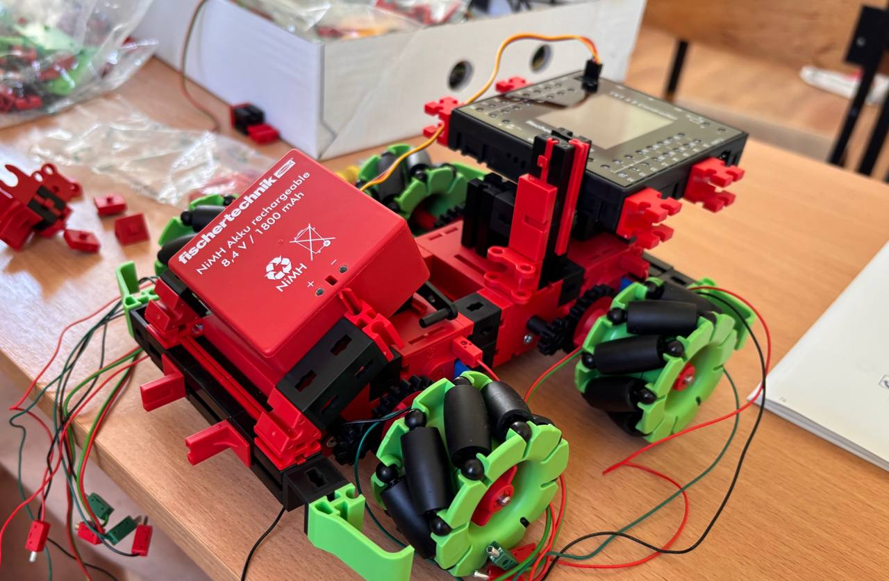
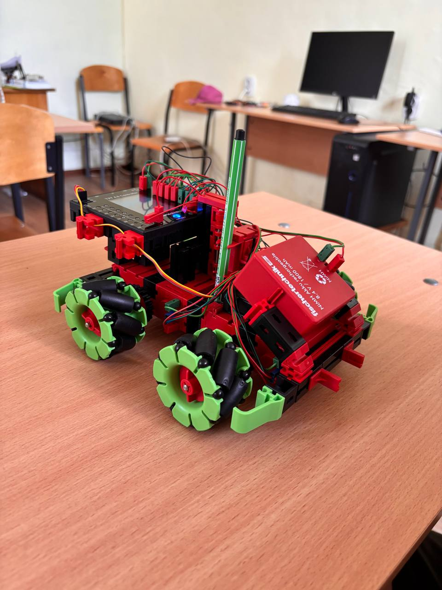
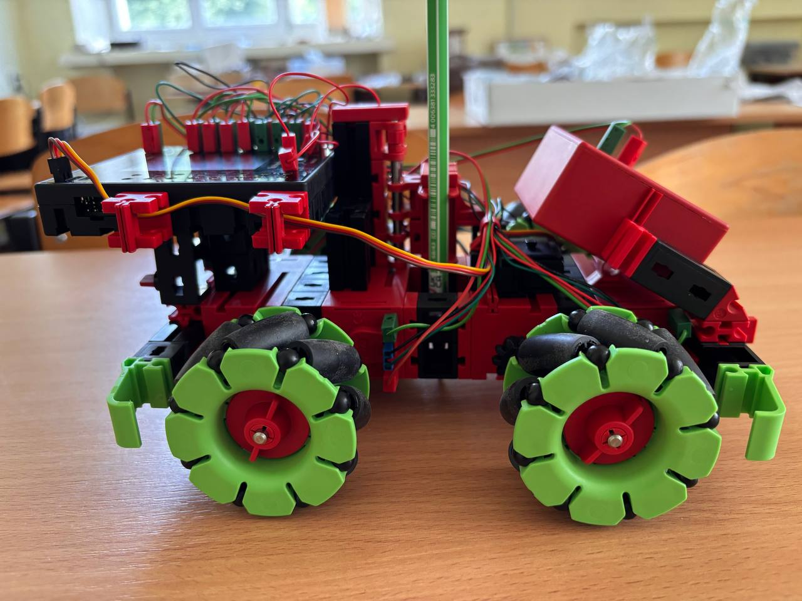
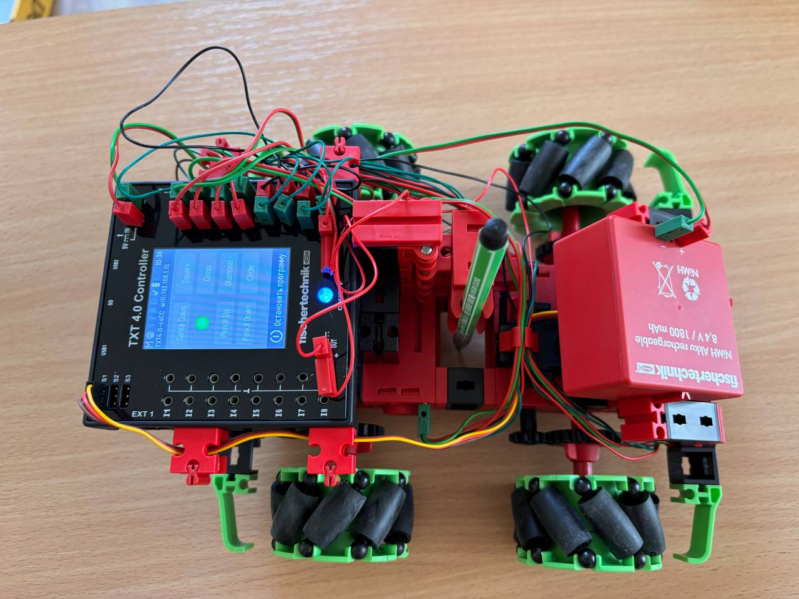
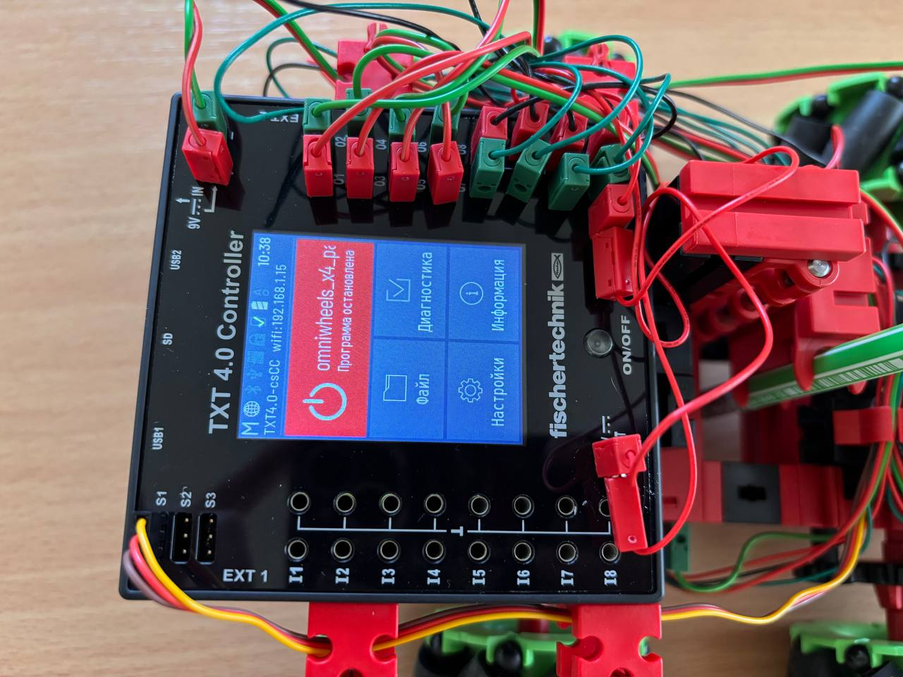
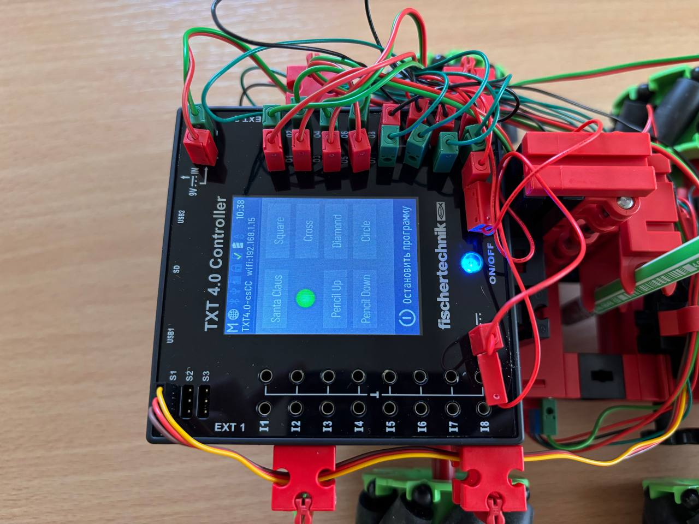

# Toy Robotics HighTech – Paint Robot

> Навчальна практика студентів

## Про проєкт

У межах навчальної практики було виконано складання, налаштування та тестування роботизованої платформи **Toy Robotics HighTech Paint Robot**.

Основною метою роботи було ознайомлення з принципами побудови мобільних роботизованих систем, складання механічної конструкції, підключення електронних компонентів, програмування робота та перевірка його працездатності.

Після завершення складання робот успішно виконує автоматичне малювання геометричних фігур і заданих шаблонів.

---

# Мета роботи

* ознайомитися з конструкцією роботизованої платформи;
* виконати механічне складання робота;
* здійснити підключення електронних модулів;
* встановити та налаштувати програмне забезпечення;
* перевірити працездатність усіх вузлів;
* протестувати режими малювання.

---

# Використане обладнання

* Toy Robotics HighTech Paint Robot
* контролер робота
* електродвигуни
* сервопривід для підйому маркера
* датчики та електронні модулі комплекту
* маркер
* персональний комп'ютер

---

# Хід виконання роботи

Під час виконання практики було виконано такі етапи:

1. Ознайомлення з комплектом конструктора.
2. Складання механічної частини робота.
3. Монтаж електронних компонентів.
4. Підключення приводів та виконавчих механізмів.
5. Перевірка правильності складання.
6. Завантаження програмного забезпечення.
7. Калібрування роботи сервопривода.
8. Тестування всіх режимів роботи.
9. Проведення серії практичних випробувань.

---

# Реалізовані режими

Робот успішно виконує автоматичне малювання:

* квадрата;
* ромба;
* кола;
* хреста;
* Санта-Клауса.

Кожна фігура обирається окремим режимом роботи та виконується автоматично без втручання користувача.

---

# Фотографії

---

# Відео демонстрації

<video controls width="600">
  <source src="Gallery/video_2026-07-07_00-00-57.mp4" type="video/mp4">
</video>

---

# Результати

Після завершення складання та налаштування робот успішно виконує всі передбачені виробником режими роботи.

Було підтверджено коректне функціонування:

* механічної конструкції;
* приводів;
* сервопривода;
* системи керування;
* алгоритмів побудови фігур.

У процесі тестування всі режими працювали стабільно.

---

# Висновок

Під час проходження навчальної практики було успішно виконано складання та налаштування роботизованої платформи Toy Robotics HighTech Paint Robot.

У ході роботи були закріплені практичні навички складання робототехнічних систем, роботи з електронними компонентами та тестування готових пристроїв.

Проведені випробування підтвердили повну працездатність робота та правильне виконання всіх передбачених функцій. Отримані результати відповідають поставленій меті практики.
